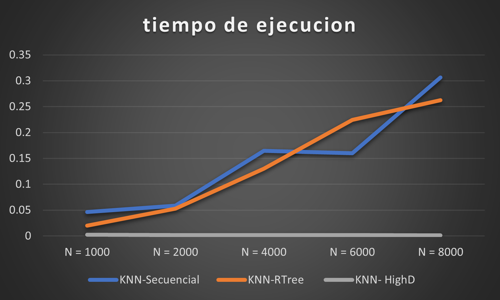

# BD_Proy3
## INTEGRANTES

|            Participante             |   Papel   |
|:-----------------------------------:|:---------:|
|  Fernando Adriano Choqque Mejia,    |  Backend  |
|    Juan Jose Leandro Blas           |  Backend  |


## INTRODUCCION
En este proyecto evaluaremos diferentes índices multidimensionales para identificar el mejor indice para la recuperación de archivos de audio. Se explorarán tres enfoques principales: índices secuenciales, índices R-tree y técnicas de Local Sensitive Hashing (LSH).

## DATASET
Utilizaremos los archivos de audio ofrecidos por Free Music Archive(FMA).
utilizamos especificamente a fma_small el cual contiene 8 mil traks de canciones de diversos tipos. Las cuales se procesaran posteriormente por CLAP.

## Audio Feature extraction: CLAP
Segun Hugging Face:
CLAP (Contrastive Language-Audio Pretraining) is a model that learns acoustic concepts from natural language supervision and enables “Zero-Shot” inference.
"CLAP (Contrastive Language-Audio Pretraining) is a neural network trained on a variety of (audio, text) pairs. It can be instructed in to predict the most relevant text snippet, given an audio, without directly optimizing for the task. T.he CLAP model uses a SWINTransformer to get audio features from a log-Mel spectrogram input, and a RoBERTa model to get text features Both the text and audio features are then projected to a latent space with identical dimension. The dot product between the projected audio and text features is then used as a similar score."


El modulo de audio utiliza un audio encoder.


Si bien el objetivo del modelo no es la extraccion de caracteristicas, en su entrenamiento aprendio a representar de manera eficiente a un audio. Por lo que utilizamos ese modulo para obtener los vectores caracteristicos.

[CLAP github](https://github.com/microsoft/CLAP)


utilizamos la implementacion de CLAP ofrecida por Hugging Face, especificamente la parte de extraccion: get_audio_features del cual obtendremos un vector de 512 dimensiones. 

```python
def extraction_feature(audio_path, model, feature_extractor):
    # Cargar el archivo de audio usando librosa
    audio, sr = librosa.load(audio_path)
    audio_tensor = torch.tensor(audio)
    inputs = feature_extractor(audio_tensor, return_tensors="pt")
    # Obtener las características del audio usando el modelo
    audio_features = model.get_audio_features(**inputs)

    audio_features_numpy = audio_features.detach().numpy()[0]

    return audio_features_numpy
```

Posteriormente utilizo la libreia pickle para guardar el path del audio junto con el vector caracteristico.


## INDICES
### SEQUENTIAL
se implementaron 2 algoritmos:
- range_search: El cual ejecuta una busqueda lineal sobre los audios para encontrar los audios cuya distancia sea menor que un radio.


- knnHeap: Se utiliza un heap de tamaño k para obtener los k audios mas cercanos a my query utilizando un maxHeap


### RTREE


Un R-tree es una estructura de datos especializada utilizada en el ámbito de las bases de datos espaciales y la indexación espacial. 
La función principal de un R-tree es organizar objetos espaciales en una jerarquía de nodos, donde cada nodo representa un conjunto de objetos y su espacio circunscrito. Esto permite una búsqueda eficiente de objetos cercanos en términos de coordenadas espaciales

```python
def knnSearch(self, k):
        results = []   
        # transformandolo a bounding box falsas
        coord_query = self.query_features + self.query_features

        nearest = list(self.idx.nearest(coordinates=coord_query, num_results=k))

        for ids in nearest:
            path,feature = self.features[ids]
            dist = np.linalg.norm(feature - self.query_features)
            results.append((dist, path))

        return results, query_time
```

### LSH


FAISS (Facebook AI Similarity Search) es una biblioteca desarrollada por Facebook específicamente para la búsqueda de similitud eficiente en conjuntos de datos grandes. Te proporciona herramientas para realizar búsquedas rápidas y aproximadas en vectores de alta dimensionalidad, como los que se encuentran comúnmente en problemas de aprendizaje profundo y procesamiento de lenguaje natural.

- knn_query: Se busca los k elementos mas cercanos a la query. 


## EXPERIMENTACION
Se realizo varias pruebas con los indices con diferentes cantidades de datos.



Donde visualizamos que el Rtree llega a ser peor que el sequencial en ciertos tramos. Al contrario el indice LSH logra un reendimiento superior para este tipo de 

## CONCLUSIONES
En conclusion se demostro que para manejar MIR es mas eficiente en tiempo de ejecucion la utilizacion de un indice LSH.